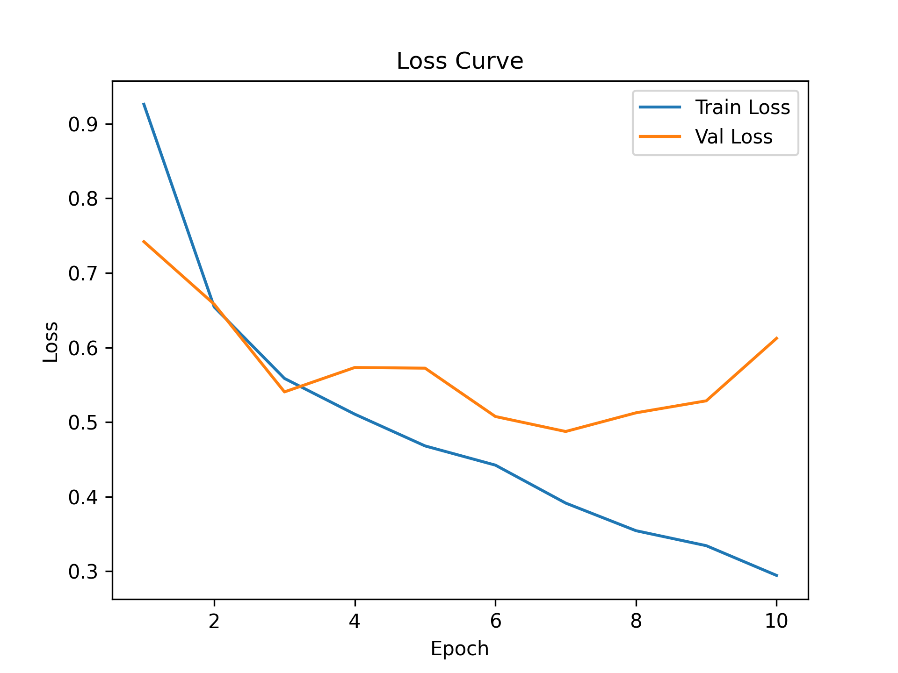
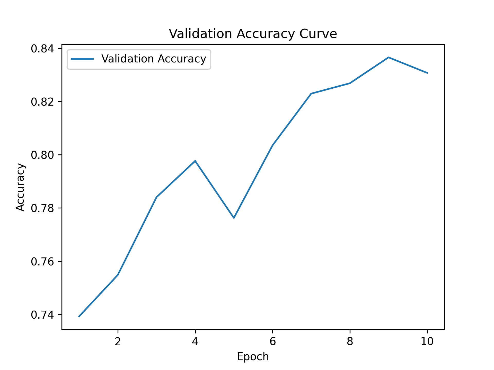
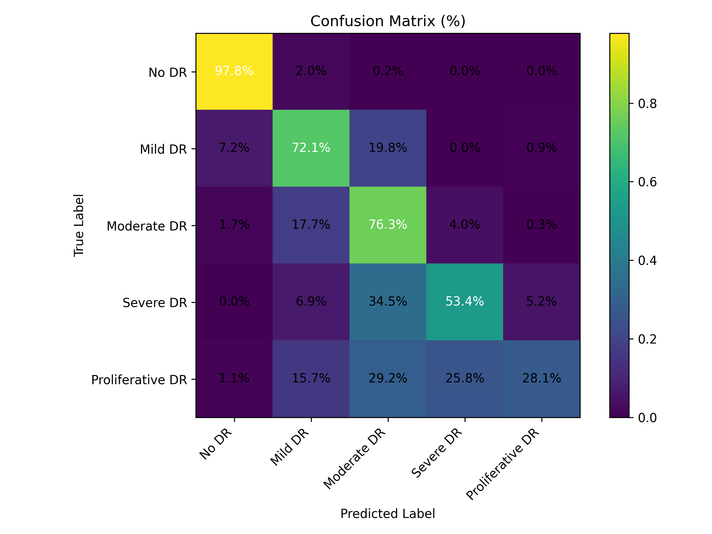

````markdown
# OphAgent

OphAgent 是一个面向眼科医学影像的 AI 项目。  
当前版本：**v0.1.0 Vision Baseline**

> 注意：当前版本还不是完整的 Agent 系统。  
> v0.1.0 主要目标是构建一个可复现、可评估、可扩展的眼底图像分类 baseline。

---

# 项目目标

OphAgent 的长期目标是构建一个多模态眼科 AI 助手，支持：

- 眼底图像分析
- 疾病分类
- 病灶可解释性分析
- 结构化医学 Findings
- 自动报告生成
- Agent 化临床交互

当前阶段仅聚焦于视觉 baseline。

---

# 当前版本：v0.1.0 Vision Baseline

当前已实现：

- APTOS2019 ImageFolder 数据加载
- ConvNeXt-Tiny 训练 pipeline
- YAML 配置化实验管理
- 可复现实验目录结构
- 训练日志与训练曲线保存
- 单张图片推理
- Test set 批量评估
- 混淆矩阵可视化

当前未实现：

- Grad-CAM 可解释性分析
- 外部数据集泛化验证
- Structured Findings
- 自动报告生成
- RAG
- Agent Workflow

---

# 数据集结构

当前使用数据集：

```text
/data/LRT/RETFound/Data_split/APTOS2019/
├── train/
├── val/
└── test/
````

# 类别定义

| Label Folder     | Clinical Meaning                   |
| ---------------- | ---------------------------------- |
| anodr            | No Diabetic Retinopathy            |
| bmilddr          | Mild Diabetic Retinopathy          |
| cmoderatedr      | Moderate Diabetic Retinopathy      |
| dseveredr        | Severe Diabetic Retinopathy        |
| eproliferativedr | Proliferative Diabetic Retinopathy |

---

# 模型训练

```bash
python -m models.classifiers.train_classifier --config configs/vision_baseline.yaml
```

---

# 单图推理

```bash
python -m models.classifiers.infer_classifier --image /path/to/image.png --config configs/vision_baseline.yaml --checkpoint experiments/aptos_convnext_tiny/lr1e-4_bs32_seed42/checkpoints/convnext_tiny_best.pth
```

输出示例：

```text
Prediction: Severe DR
Confidence: 0.81
```

---

# Test Set 批量评估

```bash
python -m models.classifiers.evaluate_classifier --config configs/vision_baseline.yaml --checkpoint experiments/aptos_convnext_tiny/lr1e-4_bs32_seed42/checkpoints/convnext_tiny_best.pth --split test
```

评估结果会保存到：

```text
evaluation/
├── metrics.json
├── classification_report.txt
├── confusion_matrix.png
└── test_predictions.csv
```

---

# v0.1.0 实验结果

数据集：APTOS2019
Backbone：ConvNeXt-Tiny
输入尺寸：224 × 224
随机种子：42

| 指标              |     数值 |
| --------------- | -----: |
| Test Accuracy   | 81.36% |
| Macro Precision | 70.79% |
| Macro Recall    | 65.55% |
| Macro F1        | 64.96% |
| Weighted F1     | 80.93% |

---

# 训练曲线





---

# 混淆矩阵



---

# Demo 展示

`demo_samples/` 中仅包含少量随机抽样测试图片，用于 Streamlit Demo 展示，不代表完整测试集结果。

---


# 实验目录结构

```text
experiments/
└── aptos_convnext_tiny/
    ├── legacy_v0_1_baseline/
    └── lr1e-4_bs32_seed42/
        ├── checkpoints/
        ├── configs/
        ├── figures/
        ├── logs/
        └── evaluation/
```

---

# Roadmap

## v0.2.0

* Grad-CAM 可解释性分析
* 热力图可视化
* 病灶区域定位

## v0.3.0

* 外部数据集泛化验证
* Cross-dataset evaluation
* Domain shift 分析

## v0.4.0

* Structured Findings
* 医学结构化结果生成

## v0.5.0

* 自动报告生成
* 多模态报告模板

## v0.6.0

* OphAgent Agent Workflow
* 工具调用与多模块协同

---

# Disclaimer

本项目仅用于科研与工程演示。
不用于真实临床诊断与医疗决策。

```
```
