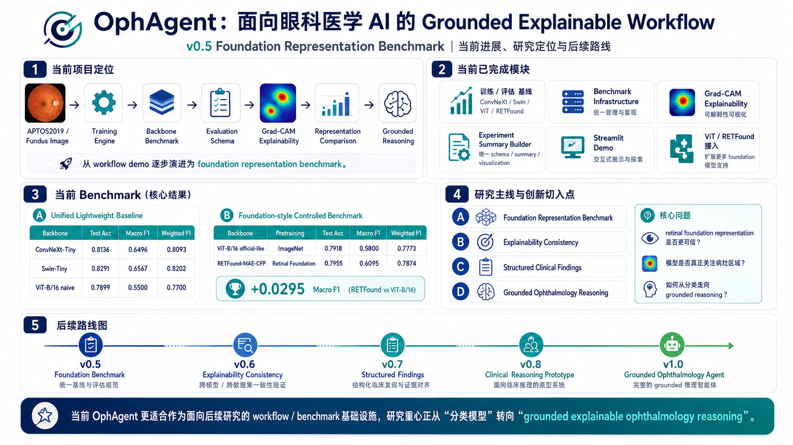
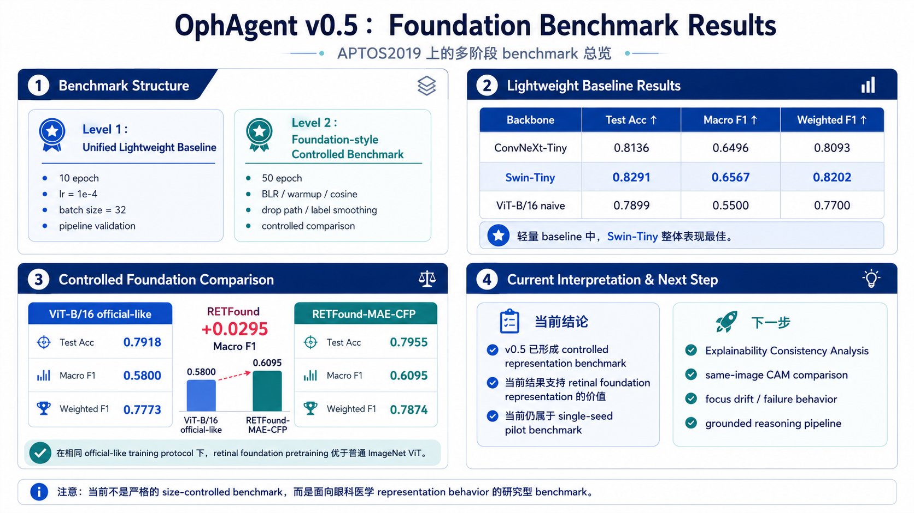
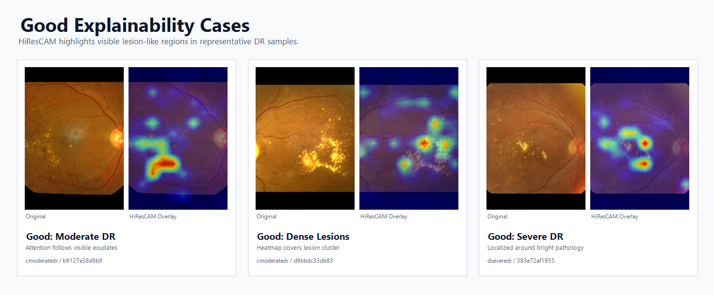

# OphAgent

## 面向眼科基础模型的可信评测工作流



OphAgent 是一个面向眼科医学影像的 AI workflow 项目，当前正在从早期的：

```text
workflow demo
```

逐步演进为：

```text
trustworthy ophthalmic foundation benchmark
```

本项目目前以 APTOS2019 眼底图像分类任务为主要实验场景，重点分析不同视觉表示在糖尿病视网膜病变分级任务中的性能、类别不均衡表现、可解释性与 hardcase 行为差异。

当前项目重点关注：

- 眼科影像分类训练与评测流程
- 多种视觉 backbone 的 benchmark 对比
- RETFound 等眼科基础模型表示能力分析
- benchmark artifact consistency 与 reproducibility
- Grad-CAM 可解释性展示
- 后续可信评测方向探索

> 本项目仅用于科研、工程实践与项目展示，不用于临床诊断、治疗建议或真实医疗决策。

---

## Research Focus

本项目关注的问题不是单纯追求最高分类准确率，而是希望进一步分析：

```text
不同 ophthalmic foundation representations 在性能、解释性和 hardcase 行为上的差异。
```

当前研究关注点包括：

- 不同 backbone 在类别不均衡 DR grading 任务中的表现差异
- RETFound 等眼科基础模型与通用 ImageNet backbone 的对比
- retinal-domain initialization 对 long-tail DR 类别的影响
- Grad-CAM 热力图是否能辅助理解模型决策
- 错分样本、低置信样本和 hardcase 的表现特征
- 后续向 calibration、explainability consistency 和 uncertainty-aware triage 扩展

---

## Workflow

当前 workflow 包括：

```text
APTOS2019 / Fundus Image
        ↓
Training Engine
        ↓
Backbone Benchmark
        ↓
Evaluation Schema
        ↓
Grad-CAM Explainability
        ↓
Representation Comparison
        ↓
Grounded Reasoning Exploration
```

---

## v0.5 Foundation Benchmark



v0.5 阶段主要围绕 foundation representation benchmark 展开，目标是建立一个可复现、可解释、可持续扩展的眼科基础模型评测流程。

---

## Benchmark Consistency Repair（v0.5.2）

v0.5.2 对 benchmark pipeline 进行了 consistency repair，修复了早期实验中由历史命名与 checkpoint 复用导致的 artifact inconsistency。

修复后，当前 benchmark 被划分为两个部分：

### Lightweight Baselines

- ConvNeXt-Tiny
- Swin-Tiny
- ViT-B/16（ImageNet pretrained）

### Official-like Controlled Benchmark

- ViT-B/16 official-like
- RETFound-MAE-CFP official-like

在 official-like controlled benchmark 中，仅保留：

- initialization difference

其余训练设置保持一致，包括：

- optimizer
- batch size
- augmentation
- learning rate schedule
- regularization
- random seed

该设置用于更严格地比较：

```text
ImageNet pretrained initialization
vs
retinal-domain foundation initialization
```

---

## Benchmark Results

### Lightweight Baselines

| Backbone | Setting | Accuracy | Macro-F1 | Weighted-F1 | QWK |
|---|---|---:|---:|---:|---:|
| ConvNeXt-Tiny | lightweight baseline | 0.814 | 0.650 | 0.809 | 0.862 |
| Swin-Tiny | lightweight baseline | 0.829 | 0.657 | 0.820 | 0.898 |
| ViT-B/16 | lightweight baseline | 0.818 | 0.646 | 0.814 | 0.876 |

### Official-like Controlled Benchmark

| Backbone | Setting | Accuracy | Macro-F1 | Weighted-F1 | QWK |
|---|---|---:|---:|---:|---:|
| ViT-B/16 | official-like | 0.799 | 0.567 | 0.778 | 0.829 |
| RETFound-MAE-CFP | official-like | 0.804 | 0.583 | 0.789 | 0.866 |

---

## 当前观察

当前 benchmark 结果显示：

- Swin-Tiny 在 lightweight baseline 设置下取得了最高 Accuracy、Weighted-F1 与 QWK
- ViT-B/16 lightweight baseline 已接近 ConvNeXt-Tiny 与 Swin-Tiny
- 在 official-like controlled benchmark 中，RETFound-MAE-CFP 相比 ImageNet ViT-B/16 存在小幅稳定增益
- RETFound initialization 对 long-tail DR 类别有一定帮助
- Severe DR 类别仍然表现较差，说明 retinal-domain initialization 本身不足以解决 APTOS2019 的严重类别不平衡问题
- RETFound official-like 的训练成本明显高于 ViT official-like，约为 3.3×，因此需要结合 cost-performance tradeoff 进行分析

需要注意的是：

当前 benchmark 同时包含：

- lightweight baseline
- official-like controlled benchmark

且当前结果仍基于：

- 单次训练（single-run benchmark）
- 单随机种子（seed=42）

因此当前观察更适合作为：

- representation behavior analysis
- initialization effect observation
- benchmark infrastructure validation

而不是严格意义上的统计显著性结论。

---

## Explainability



当前项目已集成 Grad-CAM 可解释性流程，用于观察不同 backbone 在眼底图像分类任务中的关注区域差异。

当前 explainability 模块包括：

- Grad-CAM
- backbone-specific Grad-CAM wrapper
- heatmap overlay 导出
- 可解释性结果展示

当前 explainability 模块主要用于：

```text
从可视化角度观察不同 backbone 的关注区域差异。
```

后续可进一步扩展：

- HiResCAM / EigenCAM / LayerCAM 等 CAM variants
- explainability consistency evaluation
- 同一图像在不同扰动、增强或 checkpoint 下的 CAM 稳定性分析

---

## Current Progress

### 已完成

- APTOS2019 眼底图像分类训练流程
- ConvNeXt / Swin / ViT / RETFound 多 backbone benchmark
- RETFound-MAE-CFP 权重接入与实验适配
- multi-metric benchmark evaluation
- QWK evaluation
- per-class F1 analysis
- prediction entropy analysis
- top1-top2 margin analysis
- confusion matrix generation
- benchmark artifact consistency repair
- official-like controlled benchmark
- Grad-CAM 可解释性展示
- 实验结果、配置与 artifact 管理
- v0.5 benchmark 文档整理

### 进行中

- benchmark 文档与 summary artifact 同步
- hardcase 样本分析
- explainability consistency 方案设计
- calibration 相关指标设计

### 后续方向

- Explainability Consistency Analysis
- Calibration Evaluation
- Uncertainty-aware Hardcase Triage
- Structured Clinical Findings
- Grounded Ophthalmology Reasoning

---

## Documentation

| 页面 | 内容 |
|---|---|
| [v0.5.2 Benchmark Summary](experiments/summary/v0_5_2/README.md) | v0.5.2 unified multi-metric benchmark summary |
| [v0.5 Foundation Benchmark](experiments/summary/v0_5_0/foundation_benchmark.md) | v0.5 benchmark 设计、结果与当前观察 |
| [v0.4.2 README Archive](docs/v0_4_2_readme_archive.md) | v0.5 重构前的旧版 README 归档 |
| [Experiment Summaries](experiments/summary/) | 各阶段 benchmark summary 与实验结果 |
| [Development Notes](notes/) | 版本开发记录 |
| [Grad-CAM Assets](docs/assets/) | 可解释性与展示图片 |
| [Changelog](CHANGELOG.md) | 版本更新记录 |

---

## Repository Structure

```text
ophagent-medical-ai-agent/
├── app/                    # Demo 与展示入口
├── configs/                # 训练与模型配置
├── docs/                   # 项目文档
│   ├── assets/             # README 与文档图片资源
│   └── v0_4_2_readme_archive.md
├── experiments/            # 实验输出与 summary
├── explain/                # Grad-CAM 可解释性模块
├── findings/               # 结构化 findings 相关模块
├── metrics/                # 评测指标与结果处理
├── models/                 # backbone、数据集与分类模型定义
│   ├── classifiers/        # 训练、推理、评估入口
│   ├── checkpoints/        # RETFound 等模型权重
│   └── datasets/           # APTOS2019 数据集封装
├── notes/                  # 开发记录
├── reasoning/              # report / reasoning 相关模块
└── scripts/                # 工具脚本
```

---

## Config Structure

当前主实验配置包括：

```text
configs/
├── vision_baseline.yaml
├── swin_tiny_baseline.yaml
├── vit_base_patch16_clean.yaml
├── vit_base_patch16_official_like_clean.yaml
├── retfound_mae_cfp_official_like_clean.yaml
└── report_generation.yaml
```

其中：

- `vision_baseline.yaml`：ConvNeXt-Tiny lightweight baseline
- `swin_tiny_baseline.yaml`：Swin-Tiny lightweight baseline
- `vit_base_patch16_clean.yaml`：ViT-B/16 ImageNet lightweight baseline
- `vit_base_patch16_official_like_clean.yaml`：ViT-B/16 official-like controlled benchmark
- `retfound_mae_cfp_official_like_clean.yaml`：RETFound-MAE-CFP official-like controlled benchmark
- `report_generation.yaml`：报告生成相关配置

---

## Roadmap

| Version | Focus | Status |
|---|---|---|
| v0.5.0 | Foundation Representation Benchmark | Completed |
| v0.5.1 | Multi-metric Benchmark Evaluation | Completed |
| v0.5.2 | Benchmark Consistency Repair | Completed |
| v0.6.0 | Explainability Consistency Benchmark | Planned |
| Future | Calibration & Uncertainty-aware Triage | Planned |

---

## 使用声明

本项目仅用于科研、工程实践与项目展示，不用于临床诊断、治疗建议或真实医疗决策。