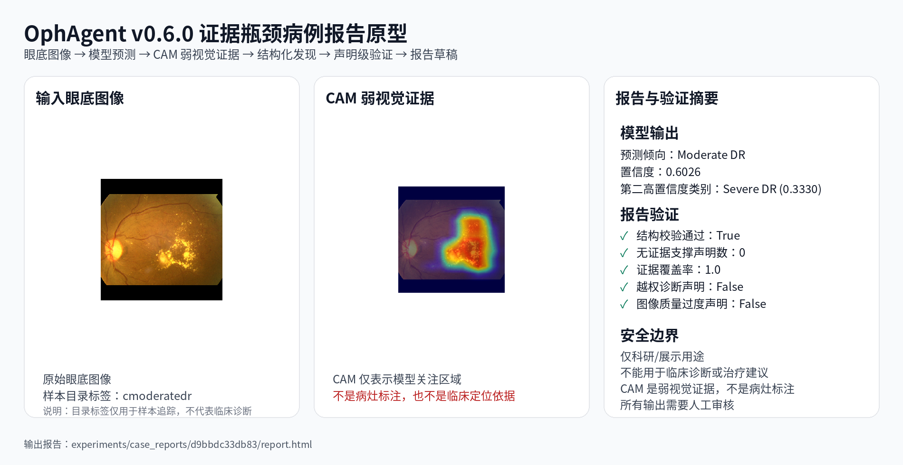

# OphAgent

## 眼科基础模型评测与证据瓶颈病例报告原型

OphAgent 是一个面向眼科医学影像的 AI workflow 项目。项目最初从眼底图像分类 benchmark、CAM 可解释性分析出发，当前进一步升级为一个可审计、可追踪、可扩展的病例报告原型。

当前项目主线可以概括为：

    眼科基础模型评测
    +
    CAM 弱视觉证据
    +
    结构化 findings
    +
    声明级验证
    +
    受控报告草稿生成

本项目不声称实现临床报告生成模型，也不声称达到眼科报告生成 SOTA。当前目标是在缺少图像-报告配对数据、病灶级标注、完整临床上下文的条件下，构建一个可追踪、可审核、未来可升级的 evidence-bottleneck workflow baseline。

> 本项目仅用于科研、工程实践与项目展示，不用于临床诊断、治疗建议或真实医疗决策。

---

## TL;DR

- 分类评测：ConvNeXt / Swin / ViT / RETFound 在 APTOS2019 DR grading 上对比。
- 可解释性：统一 CAM adapter，支持 Grad-CAM / HiResCAM / EigenCAM / LayerCAM。
- v0.6.0：Evidence-Bottleneck Case Report Prototype，即证据瓶颈病例报告原型。
  - 每条 report claim 都必须追溯到 prediction / evidence / finding。
  - `validation.json` 自动检查无依据结论和安全声明。
  - 输出 `findings.json`、`validation.json`、`report.md`、`report.html`。
- v0.6.1：Guarded LLM Report Drafting with Explicit Safety Trace。
  - 使用确定性 `MockLLMProvider` 验证受控 LLM 报告草稿生成链路。
  - 使用 `RuleBasedSafetyChecker` 检查 clinical diagnosis overclaim、CAM overclaim、unsupported lesion localization 等风险。
  - 生成 `safety_report.json`，记录 unsafe claim、fallback 决策与审计轨迹。
  - 支持 `--report-provider mock_llm` 与 `--mock-llm-mode safe/unsafe_diagnosis/unsafe_cam/unsafe_mixed`。

---

## 当前版本定位

### v0.6.0：Evidence-Bottleneck Case Report Prototype

v0.6.0 的核心流程：

    眼底图像
    → 模型预测
    → CAM 弱视觉证据
    → 结构化发现
    → 声明级验证
    → 报告草稿
    → 病例级产物

v0.6.0 的重点不是生成一段漂亮文本，而是报告前面的 evidence control layer。系统先将模型输出压缩成可验证的结构化证据，再渲染为报告草稿。

### v0.6.1：Guarded LLM Report Drafting with Explicit Safety Trace

v0.6.1 在 v0.6.0 的病例报告原型基础上，引入确定性的 guarded generation 层。

它的目标不是接入真实 LLM API，而是先验证一条更关键的链路：LLM 风格的报告草稿可以被约束、检查、审计，并在出现 unsafe claim 时安全回退到确定性模板报告。

v0.6.1 的核心流程：

    findings.json
    → constrained prompt
    → MockLLMProvider draft
    → RuleBasedSafetyChecker
    → checked LLM report or template fallback
    → safety_report.json

一句话概括：v0.6.1 的成果不是“LLM 会写报告”，而是“LLM 生成过程开始可约束、可检查、可回退、可审计”。

---

## 病例报告产物展示

v0.6.0 可以对单张眼底图像生成完整 case artifact：

示例 HTML 报告：[`report.html`](experiments/case_reports/d9bbdc33db83/report.html)

注意：GitHub 直接点击 `.html` 文件会显示源码，不会渲染页面。请点击 **Download raw file** 后本地打开查看。

示例 case 目录结构：

    experiments/case_reports/d9bbdc33db83/
    ├── input.png
    ├── prediction.json
    ├── findings.json
    ├── validation.json
    ├── report.md
    ├── report.html
    ├── metadata.json
    └── cam/
        ├── original.png
        ├── heatmap.png
        └── overlay.png

核心验证结果示例：

    schema_valid: true
    required_disclaimer_present: true
    human_review_required: true
    cam_described_as_weak_evidence: true
    clinical_diagnosis_claim_present: false
    unsupported_claim_count: 0
    evidence_coverage_rate: 1.0
    image_quality_overclaimed: false
    report_reproducible: true

---

## v0.6.1 Guarded Generation 展示

v0.6.1 的展示重点不是 HTML 页面美观，而是 safety trace，即 LLM 草稿如何被约束、检查、保留或回退。

轻量展示产物位于：[`experiments/summary/v0_6_1/`](experiments/summary/v0_6_1/README.md)

该目录包含：

- `llm_raw_safe.md`：safe mock 的原始 MockLLMProvider 输出。
- `llm_checked_safe.md`：通过 safety checker 后被接受的草稿。
- `llm_guarded_safe.html`：简化版 guarded report HTML。
- `safety_report_safe.json`：safe 路径的安全审计结果。
- `llm_raw_unsafe_cam.md`：包含 CAM overclaim 的 unsafe mock 原始输出。
- `safety_report_unsafe_cam.json`：unsafe 路径的安全审计结果。

safe mock 预期结果：

    overall_pass: true
    fallback_triggered: false
    selected_output: llm_checked_safe.md

unsafe CAM mock 预期结果：

    overall_pass: false
    fallback_triggered: true
    flagged_claim_count: 2
    selected_output: deterministic template fallback

这证明 v0.6.1 的 guarded generation 链路可以区分 safe draft 与 unsafe draft，并在检测到 CAM / heatmap 证据夸大时触发完整 fallback。

---

## 为什么不是普通模板报告

v0.6.0 / v0.6.1 的重点不是“把分类结果拼成报告”，而是围绕报告生成建立可审核的 evidence boundary。

- 每条 report claim 都有 `claim_id`。
- 每条 claim 必须通过 `supported_by` 指向 prediction / evidence / finding。
- `validation.json` 检查 unsupported claims，即无证据支撑的结论。
- CAM 被明确标注为 weak evidence，不允许写成 lesion annotation 或 lesion localization。
- 当前 evidence provider 后续可以替换为 mask / bounding box / lesion detector。
- 当前 template renderer 后续可以替换为真实 LLM / RAG / LoRA report renderer。
- v0.6.1 增加 `safety_report.json`，把 LLM draft 的安全检查和 fallback 决策显式记录下来。

也就是说，本项目不是直接追求“报告写得像医生”，而是先建立一条更可控的路径：模型输出必须先变成结构化证据，再在明确边界内生成报告草稿。

---

## validation.json 与 safety_report.json 的分工

v0.6.0 和 v0.6.1 分别引入了两个不同层级的验证产物。

`validation.json` 负责 artifact-level validation，主要检查病例级产物是否完整、基础安全声明是否存在、report claims 是否能追溯到已有 prediction / evidence / findings。它回答的问题是：

    这个 case artifact 是否结构完整、声明是否有基础证据支撑？

`safety_report.json` 负责 generation-level safety trace，主要检查 MockLLMProvider 生成的报告草稿是否越过 evidence boundary，例如 clinical diagnosis overclaim、CAM / heatmap overclaim、unsupported lesion localization 等。它回答的问题是：

    这个 LLM-style draft 是否安全？如果不安全，为什么触发 fallback？

因此，v0.6.1 中 LLM draft 的安全性以 `safety_report.json` 为准；`validation.json` 继续保留为 v0.6.0 case artifact 的基础完整性验证。

---

## Quick Start

### 运行前说明

本仓库不随代码发布训练好的 `.pth` checkpoint。`*.pth` 文件通常体积较大，已被 `.gitignore` 忽略。

因此，下面的 Quick Start 命令适用于已经在本地完成训练、并拥有对应 checkpoint 的环境。示例中使用的是作者本地实验路径：

- `experiments/aptos_convnext_tiny/lr1e-4_bs32_seed42/checkpoints/convnext_tiny_best.pth`
- `experiments/aptos_convnext_tiny/lr1e-4_bs32_seed42/configs/class_to_idx.json`

如果你只是浏览项目结构、报告产物和 v0.6.1 safety trace，不需要重新运行模型，可以直接查看：

- `experiments/case_reports/d9bbdc33db83/`
- `experiments/summary/v0_6_1/`

### v0.6.0 默认模板报告路径

在已有本地 checkpoint 的前提下，运行单张眼底图像 case report pipeline：

    python scripts/run_case_report.py \
      --image demo_samples/cmoderatedr/d9bbdc33db83.png \
      --config configs/vision_baseline.yaml \
      --checkpoint experiments/aptos_convnext_tiny/lr1e-4_bs32_seed42/checkpoints/convnext_tiny_best.pth \
      --class-to-idx experiments/aptos_convnext_tiny/lr1e-4_bs32_seed42/configs/class_to_idx.json \
      --output experiments/case_reports/d9bbdc33db83

默认会生成：

    prediction.json
    findings.json
    validation.json
    report.md
    report.html
    metadata.json
    cam/overlay.png

### v0.6.1 guarded mock LLM 路径

显式启用 guarded mock LLM report drafting：

    python scripts/run_case_report.py \
      --image demo_samples/cmoderatedr/d9bbdc33db83.png \
      --config configs/vision_baseline.yaml \
      --checkpoint experiments/aptos_convnext_tiny/lr1e-4_bs32_seed42/checkpoints/convnext_tiny_best.pth \
      --class-to-idx experiments/aptos_convnext_tiny/lr1e-4_bs32_seed42/configs/class_to_idx.json \
      --output experiments/case_reports/d9bbdc33db83_v061_demo \
      --report-provider mock_llm \
      --mock-llm-mode safe

该模式会在 v0.6.0 基础产物生成后追加 guarded generation trace：

    reports/template.md
    reports/template.html
    reports/llm_raw.md
    reports/llm_checked.md
    reports/llm_guarded.html
    safety_report.json

测试 unsafe fallback：

    python scripts/run_case_report.py \
      --image demo_samples/cmoderatedr/d9bbdc33db83.png \
      --config configs/vision_baseline.yaml \
      --checkpoint experiments/aptos_convnext_tiny/lr1e-4_bs32_seed42/checkpoints/convnext_tiny_best.pth \
      --class-to-idx experiments/aptos_convnext_tiny/lr1e-4_bs32_seed42/configs/class_to_idx.json \
      --output experiments/case_reports/d9bbdc33db83_v061_unsafe_cam_demo \
      --report-provider mock_llm \
      --mock-llm-mode unsafe_cam

注意：v0.6.1 暂不调用真实 LLM API。当前 `mock_llm` 用于验证受控生成、安全检查和 fallback 链路。

---

## Benchmark Results

### v0.5 代表性结果

| Backbone | Setting | Accuracy | Macro-F1 | Weighted-F1 | QWK |
|---|---|---:|---:|---:|---:|
| Swin-Tiny | lightweight baseline | 0.829 | 0.657 | 0.820 | 0.898 |
| ConvNeXt-Tiny | lightweight baseline | 0.814 | 0.650 | 0.809 | 0.862 |
| ViT-B/16 | lightweight baseline | 0.818 | 0.646 | 0.814 | 0.876 |
| RETFound-MAE-CFP | official-like | 0.804 | 0.583 | 0.789 | 0.866 |

当前结果基于 single-run / seed=42，更适合作为 representation behavior analysis 与 benchmark infrastructure validation，不作为统计显著性结论。

---

## Explainability

v0.5.3 引入统一 CAM adapter，使不同 backbone 可以通过统一接口生成 CAM 可解释性结果。

当前支持：

- ConvNeXt-Tiny
- Swin-Tiny
- ViT-B/16
- ViT-L/16
- RETFound-MAE-CFP

当前 CAM 结果仅作为模型注意力可视化和 qualitative sanity check，不作为病灶标注或临床定位依据。

---

## Documentation

| 页面 | 内容 |
|---|---|
| [v0.6.0 Report Generation Design](notes/v0.6.0_report_generation_design.md) | v0.6.0 证据瓶颈病例报告原型设计 |
| [v0.6.0 Case Findings Schema](docs/schema/case_findings_schema_v0_6.md) | `findings.json` 与 `validation.json` 的字段规范 |
| [v0.6.1 Guarded LLM Design](notes/v0.6.1_guarded_llm_report_design.md) | v0.6.1 受控 LLM 报告草稿生成与安全审计设计 |
| [v0.6.1 Summary Artifacts](experiments/summary/v0_6_1/README.md) | safe / unsafe mock 的 safety trace 展示 |
| [v0.6.2 Safety Regression Plan](notes/v0.6.2_safety_regression_audit_plan.md) | v0.6.2 safety regression tests 与 audit metadata 计划 |
| [v0.6.2 Safety Rule Boundaries](docs/safety/llm_report_safety_rule_boundaries.md) | RuleBasedSafetyChecker 覆盖范围、漏检风险与误杀风险 |
| [v0.6.3 Real LLM Provider Design](notes/v0.6.3_controlled_real_llm_provider_design.md) | v0.6.3 controlled real LLM provider 接入设计 |
| [v0.6.3 Real LLM Summary Artifacts](experiments/summary/v0_6_3/README.md) | v0.6.3 real LLM summary run 与 safety trace 展示 |
| [v0.6.4 Safety Probe Summary](experiments/summary/v0_6_4/README.md) | 5-case real LLM safety probe 与 unsafe mock positive control |
| [v0.6.5 Integrated Showcase](experiments/summary/v0_6_5/README.md) | 医院线下展示前的集成展示入口 |
| [Example Case Report](experiments/case_reports/d9bbdc33db83/report.md) | 示例病例报告草稿 |
| [Example Validation](experiments/case_reports/d9bbdc33db83/validation.json) | 声明级别验证结果 |
| [v0.5.3 README Archive](docs/v0_5_3_readme_archive.md) | 旧版 benchmark-oriented README 归档 |
| [Changelog](CHANGELOG.md) | 版本更新记录 |

---

## Roadmap

| Version | Focus | Status |
|---|---|---|
| v0.5.x | Benchmark + CAM adapter | Completed |
| v0.6.0 | Evidence-bottleneck case report prototype | Completed |
| v0.6.1 | Guarded LLM report drafting with safety trace | Completed |
| v0.6.2 | Safety regression tests and audit metadata | Completed |
| v0.6.3 | Controlled real LLM provider integration | Completed |
| v0.6.4 | Real LLM safety probe on a small case set | Completed |
| v0.6.5 | Integrated showcase / demo polish | Completed |
| v0.7.0 | Knowledge grounding / RAG | Planned |
| v0.8.0 | LoRA report verbalization adapter | Planned |

---

## Disclaimer

本项目仅用于科研、工程实践与项目展示。

生成的病例报告是 AI-generated research/demo draft，不是临床诊断报告，也不是治疗建议。

CAM 是 weak model attention evidence，不是病灶标注，也不是病灶定位。

v0.6.0 尚未实现自动图像质量评估。

v0.6.1 使用 MockLLMProvider 验证 guarded generation 控制链路。

v0.6.3 已接入 OpenAI-compatible real LLM provider，但当前 real LLM summary run 仅用于工程链路验证，不代表临床报告生成能力。

所有输出都需要人工审核。
