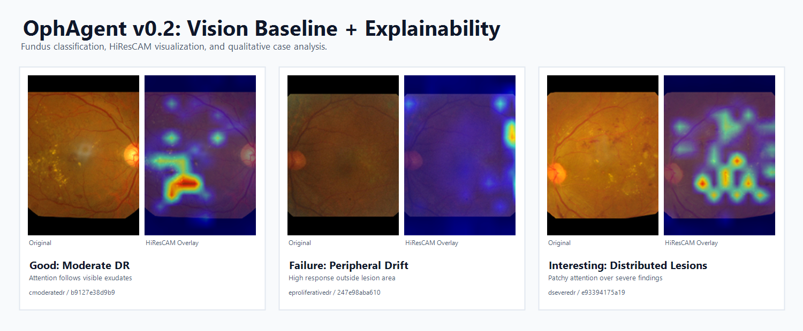
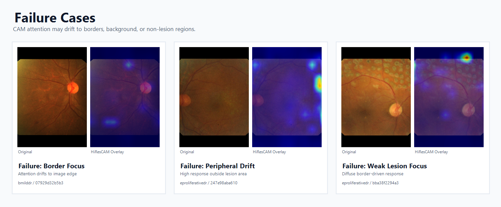
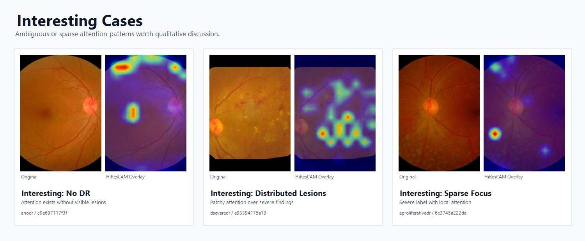
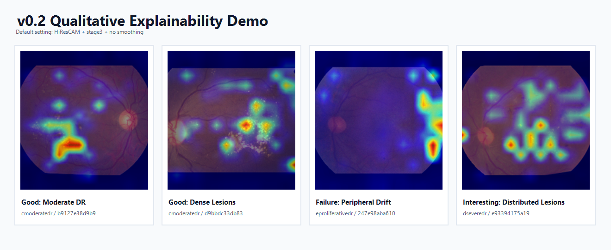

# OphAgent

> 面向眼科医学影像的可复现 AI Research Framework  
>
> DR Classification · Explainability · Qualitative Analysis · Medical AI Demo

<p align="center">
  
</p>

---

# 项目简介

OphAgent 是一个面向眼科医学影像的研究型 AI 项目，
当前聚焦于糖尿病视网膜病变（Diabetic Retinopathy, DR）分类与模型可解释性分析。

项目不仅关注分类性能，
更强调：

- 可复现实验流程（Reproducibility）
- Explainability（Grad-CAM）
- 定性失败案例分析（Failure Analysis）
- 医学影像可视化
- Demo 展示与版本化管理

当前版本（v0.2.0）已引入基于 CAM 的 Explainability Pipeline，
用于分析模型在 DR 分类中的关注区域与潜在 shortcut behavior。

---

# Key Features

- ConvNeXt-Tiny DR Classification Baseline
- YAML 配置化实验管理
- Reproducible Training Pipeline
- Grad-CAM / HiResCAM Explainability
- Failure Case Analysis
- Streamlit Interactive Demo
- Versioned Experiment Structure
- GitHub Release 权重管理

---

# Benchmark Results

APTOS2019 Test Set：

| Metric | Score |
|---|---|
| Accuracy | 81.36% |
| Macro Precision | 70.79% |
| Macro Recall | 65.55% |
| Macro F1 | 64.96% |
| Weighted F1 | 80.93% |

---

# Explainability（v0.2）

OphAgent v0.2 将 Explainability 作为核心研究模块，
用于分析模型在 DR 分类中的视觉关注行为。

当前支持：

- GradCAM
- HiResCAM
- EigenCAM
- LayerCAM

默认方案：

- Method：HiResCAM
- Target Layer：stage3
- Smoothing：disabled

该组合基于多组定性实验对比后选择，
在病灶聚焦能力与稳定性之间取得较好平衡。

---

# Visual Explainability

<p align="center">
  
</p>

---

# Why Explainability?

医学影像分类模型可能存在：

- shortcut learning
- 边缘偏置
- illumination bias
- 非病灶区域过度关注

因此，
OphAgent v0.2 引入 CAM-based Explainability，
用于辅助分析模型行为与 failure mode。

注意：

当前 Explainability 仅用于研究与可视化分析，
不代表临床病灶定位结果。

---

# Qualitative Analysis

项目当前不仅关注 quantitative metrics，
同时强调模型行为的 qualitative understanding。

当前 Explainability Gallery 包含：

- Good Cases
- Failure Cases
- Interesting Cases

目录结构：

```text
docs/gradcam_gallery/
├── good_cases/
├── failure_cases/
└── interesting_cases/
```

---

# Good Cases

<p align="center">
  
</p>

特点：

- 热区与病灶区域较一致
- 模型 attention 较稳定
- 可用于 README / Demo 展示

代表案例：

- cmoderatedr_b9127e38d9b9
- cmoderatedr_d9bbdc33db83
- dseveredr_383e72af1955

---

# Failure Cases

<p align="center">
  
</p>

Attention drifts toward retinal boundary and illumination artifacts,
showing potential shortcut behavior and unstable lesion localization.

特点：

- 热区偏离病灶
- attention 偏向边缘区域
- 受亮度与图像质量影响

代表案例：

- bmilddr_07929d32b5b3
- eproliferativedr_247e98aba610
- eproliferativedr_bba38f2294a3

---

# Interesting Cases

<p align="center">
  
</p>

特点：

- attention 行为复杂
- 病灶区域存在歧义
- 具有进一步分析价值

代表案例：

- anodr_c9e697117f3f
- dseveredr_e93394175a19
- eproliferativedr_6c3745a222da

---

# Streamlit Demo

当前 Demo 支持：

- 上传眼底图像
- Top-3 分类结果
- Explainability Gallery
- 模型指标展示
- 离线 Grad-CAM 可视化

启动方式：

```bash
streamlit run app/demo_v2.py
```

---

# Demo Preview

<p align="center">
  
</p>

---

# Project Structure

```text
app/            # Streamlit demos
configs/        # YAML experiment configs
demo_samples/   # demo images
docs/            # figures / galleries
evaluation/     # evaluation outputs
experiments/    # checkpoints / logs / evaluation
explain/        # CAM explainability
src/            # training & inference pipeline
```

---

# Installation

建议使用 Python 3.10。

安装依赖：

```bash
pip install -r requirements.txt
```

开发依赖：

```bash
pip install -r requirements-dev.txt
```

---

# Download Pretrained Weights

请从 GitHub Release 下载：

- convnext_tiny_best.pth
- checkpoint_meta.json

放置到：

```text
experiments/aptos_convnext_tiny/lr1e-4_bs32_seed42/checkpoints/
```

同时确保：

```text
experiments/aptos_convnext_tiny/lr1e-4_bs32_seed42/configs/class_to_idx.json
```

存在。

---

# Training

```bash
python train_classifier.py \
  --config configs/vision_baseline.yaml
```

训练结果默认保存到：

```text
experiments/aptos_convnext_tiny/lr1e-4_bs32_seed42/
```

包括：

```text
checkpoints/
configs/
evaluation/
figures/
logs/
```

---

# Inference

```bash
python infer_classifier.py \
  --image demo_samples/cmoderatedr/b9127e38d9b9.png \
  --config configs/vision_baseline.yaml \
  --checkpoint experiments/aptos_convnext_tiny/lr1e-4_bs32_seed42/checkpoints/convnext_tiny_best.pth \
  --class-to-idx experiments/aptos_convnext_tiny/lr1e-4_bs32_seed42/configs/class_to_idx.json
```

---

# Evaluation

```bash
python evaluate_classifier.py \
  --config configs/vision_baseline.yaml \
  --checkpoint experiments/aptos_convnext_tiny/lr1e-4_bs32_seed42/checkpoints/convnext_tiny_best.pth \
  --class-to-idx experiments/aptos_convnext_tiny/lr1e-4_bs32_seed42/configs/class_to_idx.json
```

生成结果：

```text
metrics.json
classification_report.txt
confusion_matrix.png
test_predictions.csv
```

---

# Grad-CAM Usage

示例命令：

```bash
python -m explain.gradcam \
  --image demo_samples/cmoderatedr/b9127e38d9b9.png \
  --config configs/vision_baseline.yaml \
  --checkpoint experiments/aptos_convnext_tiny/lr1e-4_bs32_seed42/checkpoints/convnext_tiny_best.pth \
  --class-to-idx experiments/aptos_convnext_tiny/lr1e-4_bs32_seed42/configs/class_to_idx.json \
  --method hirescam \
  --target-layer stage3 \
  --output experiments/aptos_convnext_tiny/lr1e-4_bs32_seed42/explain/single_test/
```

生成结果：

```text
original.png
heatmap.png
overlay.png
```

---

# Current Limitations

当前项目仍属于研究型 baseline，
尚未用于临床环境。

当前限制包括：

- 仅验证 ConvNeXt-Tiny backbone
- 缺少 cross-dataset evaluation
- DR 类别存在类别不平衡
- Explainability 仍以定性分析为主
- CAM 结果可能受到亮度与边缘结构影响

当前 CAM 可视化不等同于病灶分割或医学诊断依据。

---

# Roadmap

## v0.3 Candidate Directions

- Explainability Benchmark
- Multi-backbone Comparison
- Lesion-aware Evaluation
- Dynamic Grad-CAM Demo
- Multi-task Retina Pipeline
- Medical VLM Integration
- Retina Report Generation

---

# Releases

当前正式版本：

- v0.2.0 — Grad-CAM Explainability

GitHub Release 提供：

- 预训练权重
- checkpoint metadata
- 版本说明

---

# Citation

```bibtex
@misc{ophagent2026,
  title={OphAgent: Ophthalmology AI Research Framework},
  author={Liu Rongtao},
  year={2026},
  howpublished={GitHub repository},
  url={https://github.com/LIU-Rong-Tao/ophagent-medical-ai-agent}
}
```

---

# License

MIT License